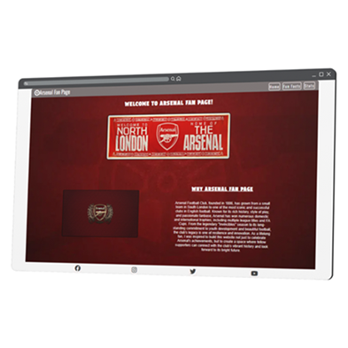
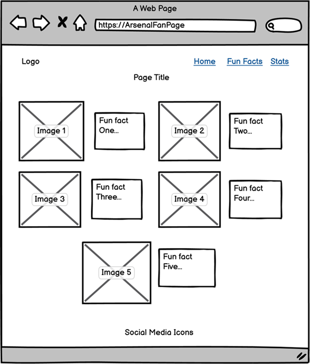
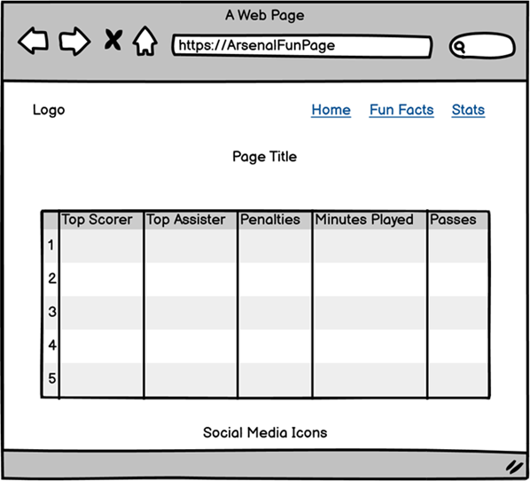

# ArsenalFunPage
Portfolio Project One. View the live website [here](https://ilyas355.github.io/Arsenal-Fan-Page/)

 

 

 

 
img[alt=mockup] { width: 200px; }
## site goals

## Features

## Design

### Wireframes
 
Home page
  

  
Fun Facts
  

  
stats
  

## Technologies

* HTML
    * The structure of the Website was developed using HTML as the main language.
* CSS
    * The Website was styled using custom CSS in an external file.
* Gitpod
    * The website was developed using Gitpod Code IDE
* GitHub
    * Source code is hosted on GitHub and delpoyed using Git Pages.
* Git 
    * Used to commit and push code during the development opf the Website
* Font Awesome
    * Icons obtained from https://fontawesome.com/ were used as the Social media links in the footer section. 
* Tinyjpg
    * https://tinyjpg.com/ was used to reduce the size of the images used throughout the website
* Favicon.io
    * favicon files were created at https://favicon.io/favicon-converter/ 
* balsamiq
    * wireframes were created using balsamiq from https://balsamiq.com/wireframes/desktop/#

## Testing

### Responsiveness

## Accessibility

## Deployment

## Credits

