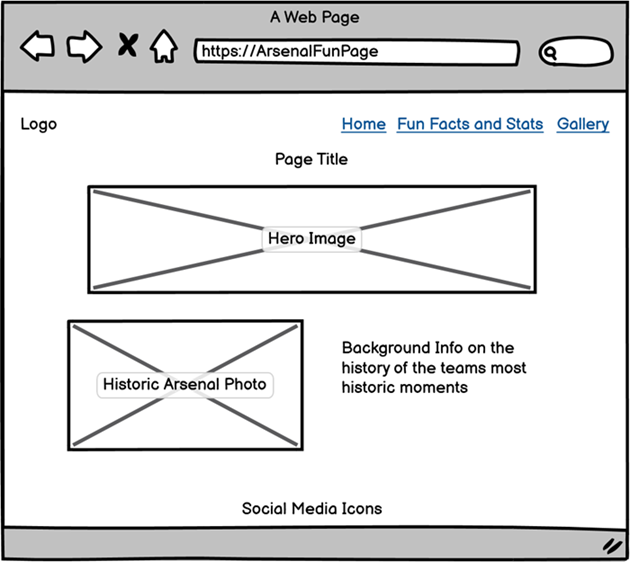
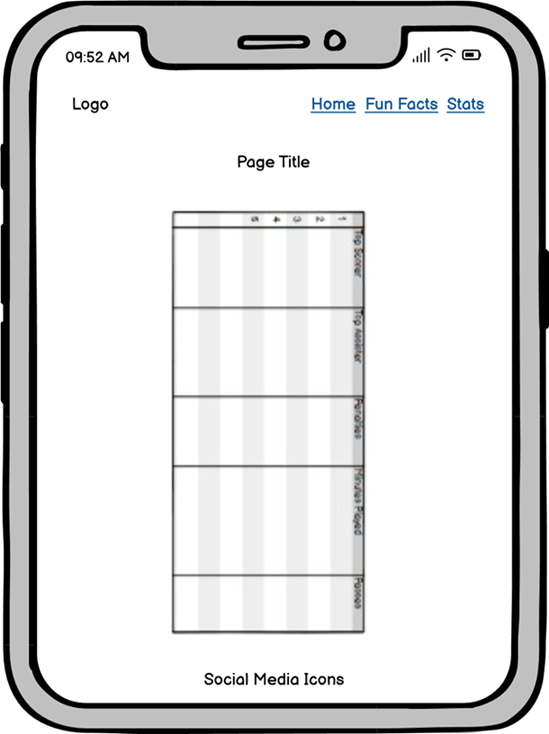
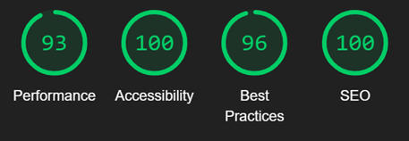
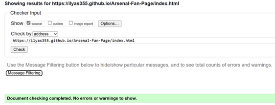

# ArsenalFanPage
## Site goals
ArsenalFanPage is a website for Arsenal fans, and those interested in Arsenal's history, which highlights valuable information around the club and its achievements. This information is split into 3: a brief summary on the history of Arsenal, 5 fun facts about Arsenal and a table demonstrating the players who achieved the top 5 stats at the football club. View the live site [here](https://ilyas355.github.io/Arsenal-Fan-Page/)


<br>


<br>


<br>


<br>

## Features

### Site wide
* Navigation Menu
    * Comprised of 3 internal links - Home, Fun Facts, Stats
    * This will allow easy navigation to the pages within the site on any device.


* Logo
    * Comprised of a football Icon taken from fontawesome.com and the word 'ArsenalFanPage' which is the name of the site.
    * Acts as a unique logo that identified the site and directs users to the home page when pressed.


* Footer
    * This will contain icons that acts as links that will open to social media websites in a new tab. The Icons will be accessible to the visually impaired by the use of aria labels.
    * This will allow users to follow 'ArsenalFanPage' on multiple accounts on different platforms to get information and updates that may not be accessible on the site.


* Favicon
    * The favicon image is an Arsenal badge that will be implemented on every page.
    * This will provide an image in the the tabs header to allow the user to easily identify the website if they have multiple tabs open.


### Landing page
* Landing page header and image
    * This will be comprised of a header and an Arsenal flag and will be the first content the user sees when they visit the site.
    * This will act as a welcoming factor for those who visit ArsenalFanPage.


* Background on Arsenal
    * This will be comprised of a background image of a style photo of the arsenal badge and a paragraph explaining why I chose to create ArsenalFanPage.
    * The image will be an additional aesthetic factor to the landing page and will be placed next to a paragraph that gives bit of background on the history of Arsenal and why Arsenal was important to me to the where I decided to create this website.


<br>

### Fun Facts Page
* Header
    * The header is placed above the grid and is a single line of text found at the top of the page.
    * It acts as the title of the grid and an introduction for users before reading all of the 5 fun facts.
* Grid
    * The Grid is comprised of 5 grid items that are displayed in a single column format on mobile screens and and with 2 columns on other devices.
    * Each grid item displays two things, an image and paragraph container. Together they serve as a 'fun fact' the has both an aesthetic aspect to it and information that expands on the image and provides context.


<br>

### Stats Page
* Table
    * Desktop - The table is presented as a normal table displaying the players who achieved the top 5 stats of Arsenal football club's history with five columns and rows excluding the headers.
    * This will shine light on the top performers at Arsenal and act as an easy way for users to attain the most notable stats of players in Arsenal's history.
    * Mobile - The table is change to be responsive for smaller screens and the format is changed so that each individual row is displayed as its own table.
    * This will be so that users are able to view the table easily without having to side scroll and decrease the users satisfaction.


### Existing Features

* Responsive design
* Landing Page with background info on Arsenal
* Responsive Grid displaying 5 fun facts
* Responsive stats table that displays Arsenal's top 5 stats


### Features Left to Implement

* As a future enhancement, the website as a whole will be more interactive by having more animations to add to the aesthetic aspect of the website.


## Design

### Wireframes
<br>

**Home Page**
<br><br>



<br><br>

**Fun Facts**
<br><br>


<br><br>

**stats**
<br><br>





## Technologies

* HTML
    * The structure of the Website was developed using HTML as the main language.
* CSS
    * The Website was styled using custom CSS in an external file.
* Gitpod
    * The website was developed using Gitpod Code IDE
* GitHub
    * Source code is hosted on GitHub and delpoyed using Git Pages.
* Git 
    * Used to commit and push code during the development opf the Website
* Font Awesome
    * Icons obtained from https://fontawesome.com/ were used as the Social media links in the footer section. 
* Tinyjpg
    * https://tinyjpg.com/ was used to reduce the size of the images used throughout the website
* Favicon.io
    * favicon files were created at https://favicon.io/favicon-converter/ 
* balsamiq
    * wireframes were created using balsamiq from https://balsamiq.com/wireframes/desktop/#

## Testing

### Browser Compatibility

| Browser tested  | Intended apperance | Intended responsiveness |
| --------------- | ------------------ | ----------------------- |
| Microsoft Edge  |        Good        |           Good          |   
| Chrome          |        Good        |           Good          |
| Firefox         |        Good        |           Good          |

### Tools Testing

* [Firefox Developer Edition](https://www.mozilla.org/en-US/firefox/developer/)

    - Firefox dev tools was used during the development process to test, explore and modify HTML elements and CSS styles used in the project.

* Responsiveness

    - [Firefox Developer Edition](https://www.mozilla.org/en-US/firefox/developer/) was used to check responsivity throughout the project.
 
* Accesibility
    - [Google Chrome Developer Tools](https://developer.chrome.com/docs/devtools/) was used for generating the lighthouse report and further reccomended documentation was utilised to increase the score.

### Responsiveness

All pages were tested to ensure responsiveness on screen sizes from 320px and upwards as defined in [WCAG 2.1 Reflow criteria for responsive design](https://www.w3.org/WAI/WCAG21/Understanding/reflow.html) on Chrome, Edge, Firefox and Opera browsers.

| Device tested      | Site responsive >=700px | Site responsive <699px  |   Renders as expected   |
| ------------------ | ----------------------- | ----------------------- | ----------------------- |
| Iphone SE          |           N/A           |           Good          |           Good          |   
| Iphone XR          |           N/A           |           Good          |           Good          |
| Pixel 7            |           N/A           |           Good          |           Good          |
| Samsung Galaxy S8+ |           N/A           |           Good          |           Good          |
| iPad Mini          |           Good          |           N/A           |           Good          |
| Surface Pro 7      |           Good          |           N/A           |           Good          |
| Nest Hub Max       |           Good          |           N/A           |           Good          |
| Asus Zenbook Fold  |           Good          |           N/A           |           Good          |

### Accessibility
[Wave Accessibility](https://wave.webaim.org/) tool was used throughout development and for final testing of the deployed website to check for any aid accessibility testing.

Testing was focused to ensure the following criteria were met:

- All forms have associated labels or aria-labels so that this is read out on a screen reader to users who tab to form inputs
- Color contrasts meet a minimum ratio as specified in [WCAG 2.1 Contrast Guidelines](https://www.w3.org/WAI/WCAG21/Understanding/contrast-minimum.html)
- Heading levels are not missed or skipped to ensure the importance of content is relayed correctly to the end user
- All content is contained within landmarks to ensure ease of use for assistive technology, allowing the user to navigate by page regions
- All not textual content had alternative text or titles so descriptions are read out to screen readers
- HTML page lang attribute has been set
- Aria properties have been implemented correctly
- WCAG 2.1 Coding best practices being followed

Manual tests were also performed to ensure the website was accessible as possible and an accessibility issue was identified.


### Lighthouse testing

* Landing Page Mobile


* Landing Page Desktop


* Fun Facts Page Mobile



* Fun Facts Page Desktop


* Stats Page Mobile


* Stats Page Desktop


### Functional Testing

**Navigation Links**

Testing was performed to ensure all navigation links on the respective pages, navigated to the correct pages as per design. This was done by clicking on the navigation links on each page. The links were also tested to check whether they change color to a shade of red when hovered. This was done by hovering over each link.

| Navigation Link | Page to Load    |
| --------------- | --------------- |
| Home            | index.html      |
| Fun Facts       | Fun-Facts.html  |
| Stats           | Stats.html      |

Links on all pages navigated to the correct pages as exptected.

**Footer Social Media Icons / Links**

Testing was performed on the Font Awesome Social Media icons in the footer to ensure that each one opened in a new tab and that each one had a hover affect of the orange branding color.

Each item opened a new tab when clicked as expected and correct hover color was present.

### Validator Testing 

- Html
    -No errors were returned when passing through the official [W3C validator](https://validator.w3.org)




- CSS
    -No errors were returned when passing through the official [W3C validator](https://validator.w3.org)


## Deployment

### Version Control

The site was created using the Visual Studio code editor and pushed to github to the remote repository ‘tacos-travels’.

The following git commands were used throughout development to push code to the remote repo:

```git add <file>``` - This command was used to add the file(s) to the staging area before they are committed.

```git commit -m “commit message”``` - This command was used to commit changes to the local repository queue ready for the final step.

```git push``` - This command was used to push all committed code to the remote repository on github.

### Deployment to Github Pages

- The site was deployed to GitHub pages. The steps to deploy are as follows: 
  - In the GitHub repository, navigate to the Settings tab 
  - From the menu on left select 'Pages'
  - From the source section drop-down menu, select the Branch: main
  - Click 'Save'
  - A live link will be displayed in a green banner when published successfully. 

The live link can be found here - https://ilyas355.github.io/Arsenal-Fan-Page/ 

### Clone the Repository Code Locally

Navigate to the GitHub Repository you want to clone to use locally:

- Click on the code drop down button
- Click on HTTPS
- Copy the repository link to the clipboard
- Open your IDE of choice (git must be installed for the next steps)
- Type git clone copied-git-url into the IDE terminal

The project will now of been cloned on your local machine for use.

## Credits

* [responsive table css](https://www.youtube.com/watch?v=Ay8BXbAmEYM)
    * Inspiration was taken from this video when styling the table and was adapted to suit my website.
* [table view on mobile screens](https://stackoverflow.com/questions/52387423/make-table-responsive-on-mobile-devices-using-html-css)
    * Code was taken from stack overflow to change the formatting of the table to fit mobile screens.

### Content

All images were taken from google images. The text on the history of arsenal and summary of the website was generated by ChatGPT.

### Media

The favicon image, being an arsenal badge, was taken from google images.
